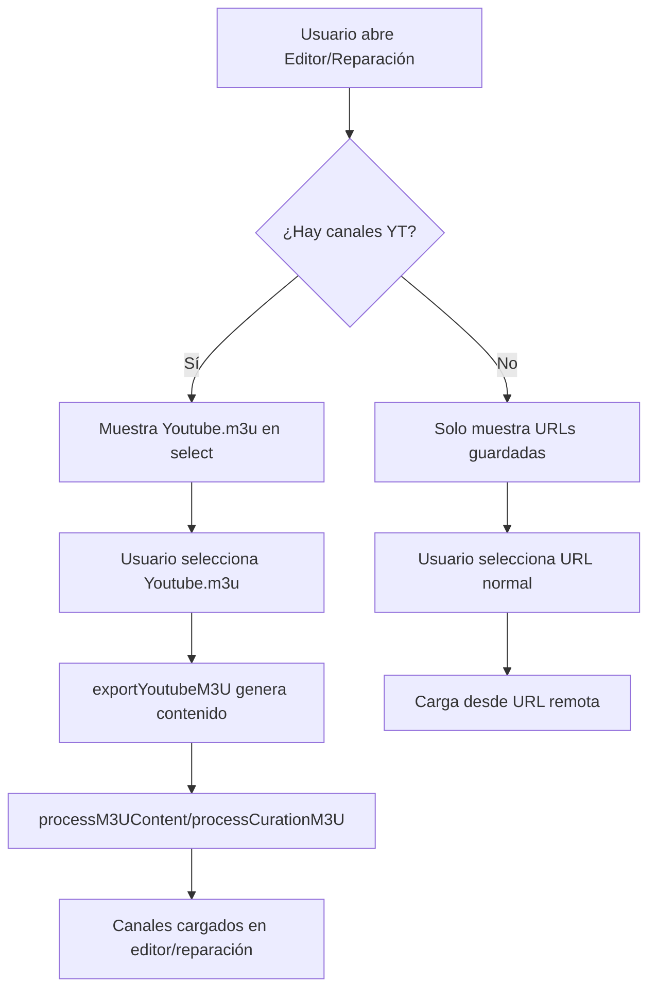

# 🎯 Nueva Funcionalidad: Youtube.m3u en Desplegables

## 📅 Fecha de Implementación
28 de octubre de 2025

---

## ✨ ¿Qué se añadió?

El archivo **`Youtube.m3u`** ahora aparece como una opción más en los desplegables de **"Listas Guardadas"** tanto en la pestaña **Editor de Playlist** como en **Reparación**.

---

## 🎬 Cómo Funciona

### 1️⃣ **Editor de Playlist**

Cuando tienes canales guardados en Youtube.m3u:

```
┌─────────────────────────────────────────────┐
│ Cargar desde URL o seleccionar lista...     │
├─────────────────────────────────────────────┤
│ ▼ o selecciona una lista guardada...        │
│   📺 Youtube.m3u (5 canales)                │
│   Mi Lista Principal                         │
│   Deportes HD                                │
│   Películas 4K                               │
└─────────────────────────────────────────────┘
```

**Al seleccionar** `📺 Youtube.m3u`:
1. Se exporta el contenido M3U desde localStorage
2. Se procesa automáticamente como si fuera una URL
3. Todos los canales de YouTube se cargan en el editor
4. Puedes editar, reorganizar o exportar los canales

---

### 2️⃣ **Reparación**

En la pestaña de Reparación, también puedes usar Youtube.m3u:

```
┌─────────────────────────────────────────────┐
│ Lista de Recambios                           │
├─────────────────────────────────────────────┤
│ Cargar desde URL...                          │
│ ▼ o selecciona una lista guardada...        │
│   📺 Youtube.m3u (5 canales)                │
│   Lista de Backups                           │
│   Canales de Respaldo                        │
└─────────────────────────────────────────────┘
```

**Al seleccionar** `📺 Youtube.m3u`:
1. Los canales de YouTube se cargan en la lista de recambios
2. Puedes usar búsqueda inteligente para encontrar coincidencias
3. Copias atributos desde los canales de YouTube a tu lista principal
4. Perfecto para actualizar URLs caducadas

---

## 🔧 Implementación Técnica

### Archivos Modificados

#### **EditorTab.tsx**
```typescript
// Se añadió acceso a youtubeChannels y exportYoutubeM3U
const { savedUrls, youtubeChannels, exportYoutubeM3U } = settingsHook;

// Se agregó processM3UContent a las funciones extraídas
const { ..., processM3UContent } = channelsHook;

// Lógica en el select
onChange={(e) => {
    if (e.target.value === 'YOUTUBE_M3U_LOCAL') {
        const m3uContent = exportYoutubeM3U();
        if (m3uContent) {
            processM3UContent(m3uContent);
        } else {
            alert('No hay canales de YouTube guardados...');
        }
    } else {
        setUrl(e.target.value);
    }
}}
```

#### **ReparacionTab.tsx**
```typescript
// Se añadió processCurationM3U a las funciones extraídas
const { ..., processCurationM3U } = reparacionHook;

// Lógica en el select
onChange={(e) => {
    if (e.target.value === 'YOUTUBE_M3U_LOCAL') {
        const m3uContent = settingsHook.exportYoutubeM3U();
        if (m3uContent) {
            processCurationM3U(m3uContent);
        }
    } else {
        setReparacionUrl(e.target.value);
    }
}}
```

#### **useChannels.ts**
```typescript
// Se exportó processM3UContent
return {
    // ... otras funciones
    processM3UContent, // ← NUEVO
    // ... más funciones
};
```

#### **useReparacion.ts**
```typescript
// Se exportó processCurationM3U
return {
    // ... otras funciones
    processCurationM3U, // ← NUEVO
    // ... más funciones
};
```

---

## 🎨 Características Visuales

### Icono Identificativo
- **📺** - Emoji de televisión para identificar Youtube.m3u visualmente
- Se distingue fácilmente de las URLs normales

### Contador de Canales
- Muestra el número de canales guardados
- Ejemplo: `📺 Youtube.m3u (5 canales)`
- Se actualiza dinámicamente

### Visibilidad Condicional
```typescript
// El select solo aparece si hay URLs guardadas O canales de YouTube
{(savedUrls.length > 0 || youtubeChannels.length > 0) && (
    <select>...</select>
)}

// Youtube.m3u solo aparece si hay canales
{youtubeChannels.length > 0 && (
    <option value="YOUTUBE_M3U_LOCAL">
        📺 Youtube.m3u ({youtubeChannels.length} canales)
    </option>
)}
```

---

## 💡 Casos de Uso

### Caso 1: Actualizar URLs Caducadas
1. Tus canales de YouTube tienen URLs caducadas (6+ horas)
2. Ve a **"YouTube Live"** y vuelve a extraer los canales
3. Guarda en Youtube.m3u (reemplaza las URLs antiguas)
4. Ve a **"Configuración"** y descarga el archivo actualizado
5. O ve a **"Editor"** y carga Youtube.m3u para editar

### Caso 2: Usar como Lista de Recambios
1. Tienes una lista principal con canales que fallan
2. Ve a **"Reparación"**
3. Selecciona `📺 Youtube.m3u` como lista de recambios
4. Usa búsqueda inteligente para encontrar coincidencias
5. Copia las URLs desde Youtube.m3u a tu lista principal

### Caso 3: Combinar Listas
1. Tienes canales en Youtube.m3u y quieres añadirlos a otra lista
2. Ve a **"Editor"**
3. Carga tu lista principal desde URL
4. En otra sesión, carga Youtube.m3u
5. Copia los canales que necesites
6. Exporta la lista combinada

---

## ✅ Validaciones

### Si no hay canales guardados
```javascript
if (!m3uContent) {
    alert('No hay canales de YouTube guardados. Ve a la pestaña YouTube Live para añadir canales.');
}
```

### Si hay canales
- Se cargan automáticamente
- Se procesa el contenido M3U
- Se muestran en el editor o lista de recambios

---

## 📊 Flujo Completo



---

## 🎯 Ventajas de esta Implementación

| Ventaja | Descripción |
|---------|-------------|
| **Integración Nativa** | Youtube.m3u se comporta como cualquier lista guardada |
| **Sin URLs Remotas** | No necesitas subir Youtube.m3u a ningún servidor |
| **Carga Instantánea** | Se lee directamente de localStorage |
| **Actualizable** | Puedes re-extraer canales y actualizar fácilmente |
| **Flexibilidad** | Úsalo en Editor para editar o en Reparación como backup |
| **Visual** | Icono 📺 y contador hacen fácil identificarlo |

---

## 🔮 Próximas Mejoras Sugeridas

1. **Auto-refresh**: Botón para actualizar todas las URLs de Youtube.m3u automáticamente
2. **Merge Inteligente**: Opción para combinar Youtube.m3u con lista principal sin duplicados
3. **Historial**: Guardar versiones anteriores de Youtube.m3u
4. **Sincronización**: Subir/descargar Youtube.m3u desde Dropbox automáticamente
5. **Programación**: Re-extracción automática cada X horas

---

## 📝 Notas Técnicas

### localStorage como Fuente
- Los datos se leen desde `localStorage.getItem('youtube_channels')`
- Se convierten a formato M3U usando `exportYoutubeM3U()`
- El contenido M3U se procesa igual que si viniera de una URL remota

### Identificador Especial
```typescript
const YOUTUBE_M3U_IDENTIFIER = 'YOUTUBE_M3U_LOCAL';
```
- Valor especial para distinguir Youtube.m3u de URLs normales
- No es una URL real, es un marcador interno

### Compatibilidad
- Funciona con toda la lógica existente de M3U
- No requiere cambios en el formato de almacenamiento
- Compatible con importación/exportación estándar

---

## 🎉 Estado

**✅ IMPLEMENTADO Y FUNCIONANDO**

- Editor de Playlist: ✅
- Reparación: ✅
- Validaciones: ✅
- UI/UX: ✅
- Documentación: ✅

---

**Desarrollado para PWA M3U Manager - YouTube Integration v2.0**
