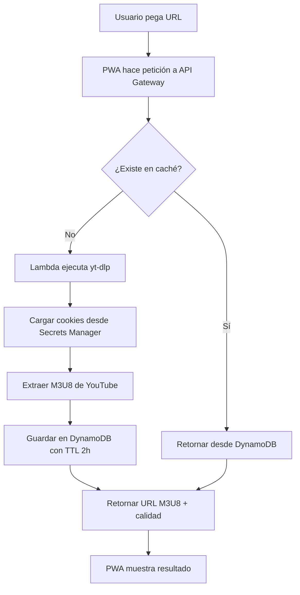

# YouTube Live Extractor - Integración con PWA M3U Manager

## 📋 Descripción

Esta funcionalidad permite añadir canales de YouTube Live directamente a tu playlist M3U desde la PWA. Utiliza una Lambda en AWS para extraer las URLs M3U8 de los streams en vivo de YouTube.

## ✨ Características

- ✅ **Extracción automática**: Obtiene las URLs M3U8 directamente desde YouTube usando yt-dlp
- ✅ **Caché inteligente**: Las URLs se cachean en DynamoDB durante 2 horas
- ✅ **Detección de calidad**: Muestra la calidad del stream extraído (SD, HD, FHD, 4K)
- ✅ **Interfaz intuitiva**: Formulario sencillo para añadir canales
- ✅ **Gestión de errores**: Sistema de reintentos para extracciones fallidas
- ✅ **Grupos personalizados**: Organiza tus canales de YouTube en grupos
- ✅ **100% compatible**: Las URLs M3U8 funcionan en cualquier reproductor IPTV

## 🚀 Cómo usar

### 1. Acceder a la pestaña YouTube Live

Ve a la pestaña "YouTube Live" en la PWA M3U Manager.

### 2. Añadir un canal

1. **Pega la URL** del canal de YouTube que esté transmitiendo en vivo:
   - Formato recomendado: `https://www.youtube.com/@CanalRedLive/live`
   - También soporta: `/watch?v=...`, `/channel/.../live`

2. **Personaliza (opcional)**:
   - Nombre del canal: Por defecto se extrae de la URL
   - Grupo: Por defecto "YouTube Live"

3. **Haz clic en "Añadir Canal"**
   - El sistema extraerá automáticamente el stream
   - Verás el estado: Extrayendo → Éxito/Error

### 3. Añadir a tu playlist M3U

Una vez que tengas canales exitosamente extraídos:

1. Haz clic en **"Añadir a Playlist M3U"**
2. Los canales se añadirán a tu lista principal
3. Podrás editarlos, reordenarlos y guardarlos como cualquier otro canal

## 🔧 Arquitectura Técnica

```
PWA Frontend (React/TypeScript)
    ↓
API Gateway (AWS)
    ↓
Lambda Function (Python 3.11 + yt-dlp)
    ↓
DynamoDB (Caché 2h) + Secrets Manager (Cookies)
    ↓
YouTube (Extracción M3U8)
```

### Componentes

- **YouTubeTab.tsx**: Componente React con la interfaz de usuario
- **Lambda**: `youtube_extractor_lambda.py` en AWS
- **API Gateway**: `https://4h0qgf6co9.execute-api.eu-west-1.amazonaws.com/Prod/youtube`
- **DynamoDB**: Tabla `YouTubeChannelsStreamlink` (TTL 2 horas)
- **Lambda Layer**: `ytdlp-python311:3` (3.2MB)

## 📝 Tipos de URLs soportadas

| Formato | Ejemplo | Estado |
|---------|---------|--------|
| `/@usuario/live` | `https://www.youtube.com/@CanalRedLive/live` | ✅ Recomendado |
| `/watch?v=...` | `https://www.youtube.com/watch?v=VIDEO_ID` | ✅ Funciona |
| `/channel/.../live` | `https://www.youtube.com/channel/UC.../live` | ✅ Funciona |
| `/@usuario/streams` | `https://www.youtube.com/@canal/streams` | ❌ No funciona |

## ⚠️ Limitaciones importantes

1. **Stream en vivo obligatorio**: El canal **debe estar transmitiendo en vivo** en el momento de añadirlo
2. **URLs temporales**: Las URLs M3U8 de YouTube caducan aproximadamente después de **6 horas**
3. **Actualización manual**: Necesitarás volver a extraer las URLs periódicamente para mantenerlas actualizadas
4. **Cookies requeridas**: La Lambda usa cookies de autenticación para evitar bloqueos de YouTube

## 🔐 Seguridad

- ✅ API Key protegida: Todas las peticiones requieren `x-api-key`
- ✅ Rate limiting: 50 req/s, 100 burst, 10k/día
- ✅ CORS configurado: Solo permite origen de la PWA
- ✅ Cookies en Secrets Manager: Credenciales seguras en AWS

## 🎯 Flujo de extracción



## 📊 Ejemplo de respuesta de la API

### Éxito
```json
{
  "success": true,
  "channel_id": "CanalRedLive",
  "youtube_url": "https://www.youtube.com/@CanalRedLive/live",
  "m3u8_url": "https://manifest.googlevideo.com/api/manifest/hls_playlist/...",
  "quality": "1080p",
  "cached": false,
  "extracted_at": "2025-10-27T21:41:22.774494"
}
```

### Error
```json
{
  "success": false,
  "error": "ERROR: [youtube] Video unavailable"
}
```

## 🛠️ Desarrollo

### Archivos modificados/creados

1. **YouTubeTab.tsx** (nuevo): Componente principal de la pestaña
2. **PWAM3UManager.tsx**: Añadida nueva pestaña al router
3. **index.ts**: Actualizado tipo `Tab` con `'youtube'`
4. **HelpTab.tsx**: Documentación actualizada

### Variables de entorno (Lambda)

- `YOUTUBE_COOKIES_SECRET`: Nombre del secret en Secrets Manager
- Región: `eu-west-1`

### Dependencias

- **Frontend**: React, TypeScript, Lucide React (iconos)
- **Backend**: Python 3.11, yt-dlp, boto3, DynamoDB

## 🔄 Actualización de URLs caducadas

Cuando las URLs M3U8 caduquen (después de ~6 horas), tienes dos opciones:

### Opción 1: Manual (implementada)
1. Ve a YouTube Live tab
2. Vuelve a añadir el mismo canal
3. Las nuevas URLs se extraerán automáticamente

### Opción 2: Automática (futura mejora)
- Crear endpoint de actualización masiva
- Programar Lambda con EventBridge (cada 4-5 horas)
- Actualizar todas las URLs automáticamente

## 📈 Próximas mejoras

- [ ] Actualización automática de URLs cada 4 horas
- [ ] Importar lista de canales desde CSV/JSON
- [ ] Previsualización del stream antes de añadir
- [ ] Notificaciones cuando un canal entre en vivo
- [ ] Historial de canales añadidos
- [ ] Exportación solo de canales de YouTube

## 🐛 Troubleshooting

### Error: "Sign in to confirm you're not a bot"
- **Causa**: Cookies caducadas o canal protegido
- **Solución**: Exportar nuevas cookies y subirlas a Secrets Manager

### Error: "No se pudo extraer la URL del stream"
- **Causa**: Canal no está en vivo
- **Solución**: Verificar que el canal esté transmitiendo y usar URL `/@canal/live`

### URLs no funcionan después de 6 horas
- **Causa**: Las URLs M3U8 de YouTube caducan
- **Solución**: Volver a extraer las URLs desde la pestaña YouTube Live

## 📞 Soporte

Para problemas con la extracción:
1. Verificar logs de CloudWatch: `/aws/lambda/youtube-extractor-streaml-YouTubeExtractorFunction-vx97lMuSLrII`
2. Comprobar que las cookies estén actualizadas en Secrets Manager
3. Verificar que la API Key esté configurada correctamente

## 📜 Licencia

Integrado en PWA M3U Manager - Uso personal/educativo
