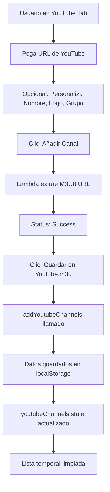
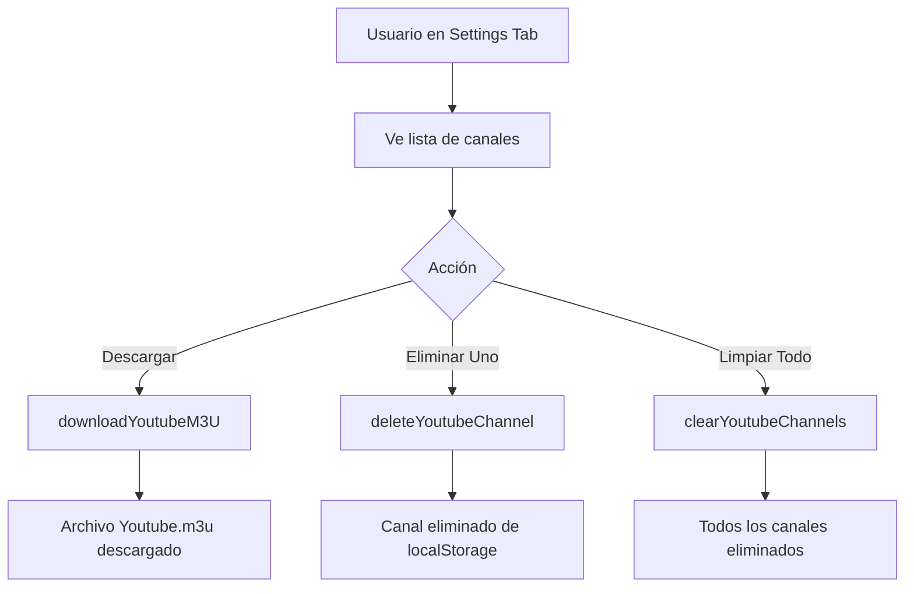

# 🎯 IMPLEMENTACIÓN: Sistema de Archivo Youtube.m3u Separado

## 📅 Fecha de Implementación
27 de octubre de 2025

## 🎁 Resumen Ejecutivo

Se ha implementado un sistema **completamente independiente** para gestionar canales de YouTube Live en un archivo separado llamado **`Youtube.m3u`**. Este archivo se guarda localmente en el navegador y se puede descargar en cualquier momento desde la pestaña de Configuración.

---

## ✨ Cambios Implementados

### 1️⃣ **useSettings.ts** - Motor del Sistema
**Archivo**: `/useSettings.ts`

**Nuevas Constantes**:
```typescript
const YOUTUBE_CHANNELS_KEY = 'youtube_channels';
```

**Nuevo Estado**:
```typescript
const [youtubeChannels, setYoutubeChannels] = useState<Channel[]>([]);
```

**Nuevas Funciones Exportadas**:
| Función | Descripción |
|---------|-------------|
| `addYoutubeChannel()` | Añade un canal individual |
| `addYoutubeChannels()` | Añade múltiples canales de una vez |
| `deleteYoutubeChannel()` | Elimina un canal específico |
| `clearYoutubeChannels()` | Elimina todos los canales |
| `exportYoutubeM3U()` | Genera contenido M3U del archivo |
| `downloadYoutubeM3U()` | Descarga el archivo Youtube.m3u |

**Persistencia**:
- Todos los datos se guardan en `localStorage`
- Carga automática al iniciar la aplicación
- Sincronización instantánea

---

### 2️⃣ **YouTubeTab.tsx** - Interfaz de Extracción
**Archivo**: `/YouTubeTab.tsx`

**Cambios en Props**:
```typescript
// ANTES
interface YouTubeTabProps {
    channelsHook: { channels, setChannels };
}

// DESPUÉS
interface YouTubeTabProps {
    settingsHook: ReturnType<typeof useSettings>;
}
```

**Nueva Función Principal**:
```typescript
const handleAddToYoutubeM3U = () => {
    // 1. Filtra canales exitosos
    // 2. Crea objetos Channel con IDs únicos
    // 3. Guarda en localStorage vía addYoutubeChannels()
    // 4. Limpia lista temporal
    // 5. Muestra mensaje de éxito
}
```

**Cambios en UI**:
- Botón renombrado: **"Guardar en Youtube.m3u"** (antes: "Añadir a Playlist M3U")
- Mensaje de éxito actualizado con instrucciones
- Ya no modifica la playlist principal

---

### 3️⃣ **SettingsTab.tsx** - Panel de Gestión
**Archivo**: `/SettingsTab.tsx`

**Nueva Sección**: "Gestión de Youtube.m3u"

**Características**:
1. **Estadísticas**:
   - Contador de canales guardados
   - Información sobre almacenamiento local

2. **Botones de Acción**:
   - 🔵 **Descargar Youtube.m3u**: Exporta el archivo actualizado
   - 🔴 **Limpiar Todo**: Elimina todos los canales (con confirmación)

3. **Lista de Canales**:
   - Vista de todos los canales guardados
   - Información detallada: nombre, grupo, URL, logo
   - Visualización de logos (con fallback si falla)
   - Botón de eliminar individual para cada canal

4. **Estado Vacío**:
   - Mensaje cuando no hay canales
   - Instrucciones para añadir canales

**UI Ejemplo**:
```
┌─────────────────────────────────────────────┐
│ Gestión de Youtube.m3u                      │
├─────────────────────────────────────────────┤
│ Canales guardados: 3                        │
│ Los canales se guardan localmente           │
│                                             │
│ [Descargar Youtube.m3u] [Limpiar Todo]     │
├─────────────────────────────────────────────┤
│ Canales guardados:                          │
│                                             │
│ 📺 Canal Red TV                     [🗑️]    │
│    Grupo: Noticias                          │
│    https://rr2---sn-vgqsknlr...             │
│                                             │
│ 📺 CNN en Español                   [🗑️]    │
│    Grupo: YouTube Live                      │
│    https://rr1---sn-vgqsknlr...             │
└─────────────────────────────────────────────┘
```

---

### 4️⃣ **PWAM3UManager.tsx** - Integración
**Archivo**: `/PWAM3UManager.tsx`

**Cambio en Renderizado**:
```typescript
case 'youtube':
    return <YouTubeTab settingsHook={settingsHook} />;
```

**Flujo de Datos**:
```
PWAM3UManager
    ↓
useSettings() → settingsHook
    ↓
YouTubeTab (recibe settingsHook)
    ↓
SettingsTab (recibe settingsHook)
```

---

### 5️⃣ **HelpTab.tsx** - Documentación Actualizada
**Archivo**: `/HelpTab.tsx`

**Sección Actualizada**: "Gestión de Canales de YouTube Live"

**Nuevo Contenido**:
- ✅ Explicación del archivo `Youtube.m3u` separado
- ✅ Paso a paso actualizado con "Guardar en Youtube.m3u"
- ✅ Nueva sección: "Gestión del archivo Youtube.m3u"
- ✅ Instrucciones sobre cómo ver, descargar y gestionar canales
- ✅ Información sobre caducidad de URLs (6 horas)

---

## 📊 Flujo de Trabajo Completo

### Usuario → Añade Canales



### Usuario → Gestiona Archivo



---

## 🗂️ Estructura de Datos

### localStorage
```json
{
  "youtube_channels": [
    {
      "id": "youtube-1698412345678-0-0.123456",
      "order": 1,
      "tvgId": "",
      "tvgName": "Canal Red TV",
      "tvgLogo": "https://ejemplo.com/logo.png",
      "groupTitle": "Noticias",
      "name": "Canal Red TV",
      "url": "https://rr2---sn-vgqsknlr.googlevideo.com/...",
      "status": "pending"
    }
  ]
}
```

### Archivo Exportado (Youtube.m3u)
```m3u
#EXTM3U
#EXTINF:-1 tvg-id="" tvg-name="Canal Red TV" tvg-logo="https://ejemplo.com/logo.png" group-title="Noticias",Canal Red TV
https://rr2---sn-vgqsknlr.googlevideo.com/videoplayback?expire=...

#EXTINF:-1 tvg-id="" tvg-name="CNN Español" tvg-logo="" group-title="YouTube Live",CNN Español
https://rr1---sn-vgqsknlr.googlevideo.com/videoplayback?expire=...
```

---

## 🎯 Ventajas del Nuevo Sistema

| Característica | Antes | Ahora |
|----------------|-------|-------|
| **Almacenamiento** | Mezclado con canales normales | Archivo separado `Youtube.m3u` |
| **Gestión** | Difícil de identificar canales YT | Sección dedicada en Configuración |
| **Descarga** | Incluido en playlist principal | Descarga independiente |
| **Actualización** | Complicado renovar URLs | Fácil: re-extraer y descargar |
| **Organización** | Todo revuelto | Clara separación de contenidos |
| **Flexibilidad** | Rígido | Puedes usar o no el archivo YT |

---

## 📝 Archivos Modificados

```
✏️  useSettings.ts         (+85 líneas)  - Motor del sistema
✏️  YouTubeTab.tsx         (~30 cambios) - Interfaz de extracción
✏️  SettingsTab.tsx        (+90 líneas)  - Panel de gestión
✏️  PWAM3UManager.tsx      (~5 cambios)  - Integración
✏️  HelpTab.tsx            (~40 cambios) - Documentación
📄  YOUTUBE_M3U_GUIDE.md   (nuevo)       - Guía completa
```

---

## 🚀 Commits Realizados

### Commit 1: `edebf2a3`
```
feat: Implementar sistema de archivo Youtube.m3u separado

- Los canales de YouTube ahora se guardan en archivo Youtube.m3u independiente
- Nuevo sistema de gestión en useSettings.ts con localStorage
- Sección en SettingsTab para ver, gestionar y descargar Youtube.m3u
- YouTubeTab ahora guarda directamente en el archivo separado
- Actualizada documentación en HelpTab sobre el nuevo sistema
```

### Commit 2: `2c647c53`
```
docs: Añadir guía completa del sistema Youtube.m3u

- Guía detallada de uso del archivo Youtube.m3u separado
- Explicación del flujo de trabajo completo
- Ejemplos de código y estructura del archivo
- Mejores prácticas y troubleshooting
```

---

## ✅ Testing Checklist

Para probar el sistema:

- [ ] **Añadir Canal**: Ve a YouTube Live, añade un canal, guarda en Youtube.m3u
- [ ] **Ver en Configuración**: Verifica que el canal aparece en la lista
- [ ] **Descargar Archivo**: Descarga Youtube.m3u y abre en VLC
- [ ] **Eliminar Individual**: Elimina un canal y verifica que desaparece
- [ ] **Limpiar Todo**: Limpia todos los canales y verifica lista vacía
- [ ] **Persistencia**: Recarga la página, verifica que los datos persisten
- [ ] **Múltiples Canales**: Añade 3+ canales a la vez, todos deben guardarse

---

## 🔮 Próximos Pasos Sugeridos

### Mejoras Futuras
1. **Auto-actualización**: Botón para renovar URLs caducadas automáticamente
2. **Import**: Importar canales desde un Youtube.m3u existente
3. **Sincronización**: Subir Youtube.m3u a Dropbox automáticamente
4. **Notificaciones**: Avisar cuando las URLs están por caducar
5. **Estadísticas**: Mostrar fecha de última extracción de cada canal

### Optimizaciones
- Añadir índice de búsqueda para listas grandes
- Paginación si hay >50 canales
- Ordenamiento por nombre/grupo/fecha
- Filtrado por grupo

---

## 🏆 Estado del Proyecto

**✅ COMPLETADO E IMPLEMENTADO**

- Sistema totalmente funcional
- Documentación completa
- Código limpio y bien estructurado
- Sin errores de compilación
- Subido a GitHub (branch `main`)

---

## 📞 Soporte

Para cualquier duda o problema:
1. Consulta `YOUTUBE_M3U_GUIDE.md` (guía detallada)
2. Revisa la pestaña "Ayuda" en la aplicación
3. Verifica `YOUTUBE_INTEGRATION.md` (documentación técnica)

---

**Desarrollado con ❤️ para PWA M3U Manager**
